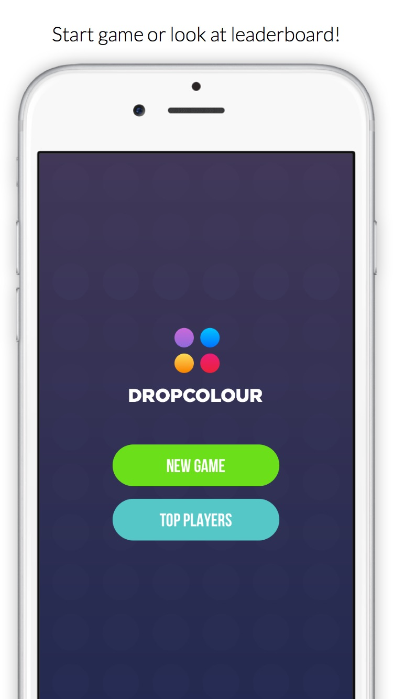
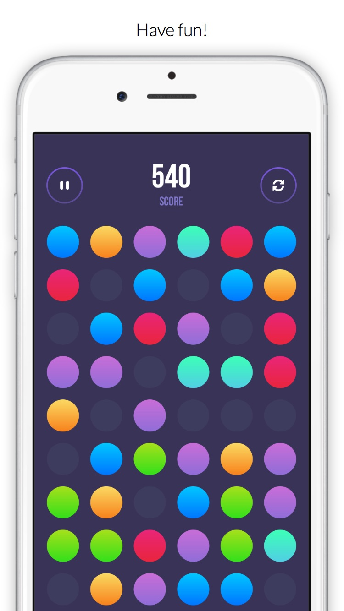
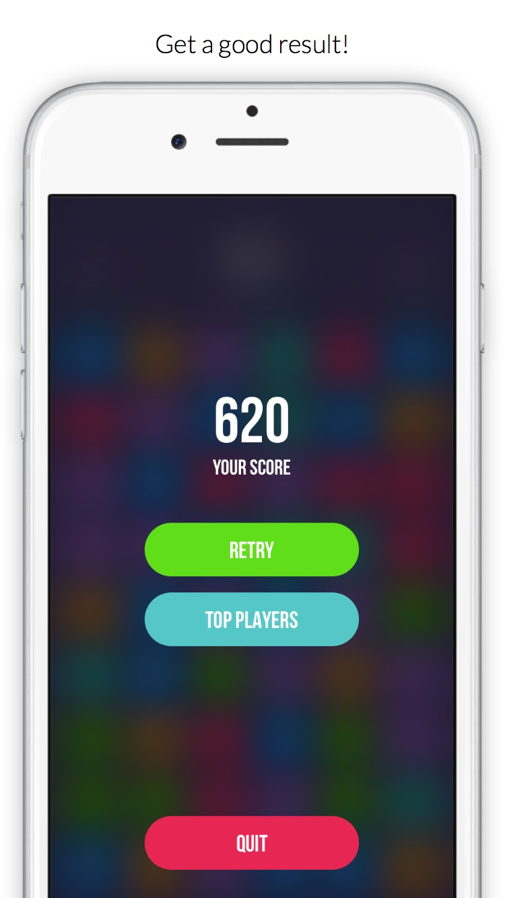
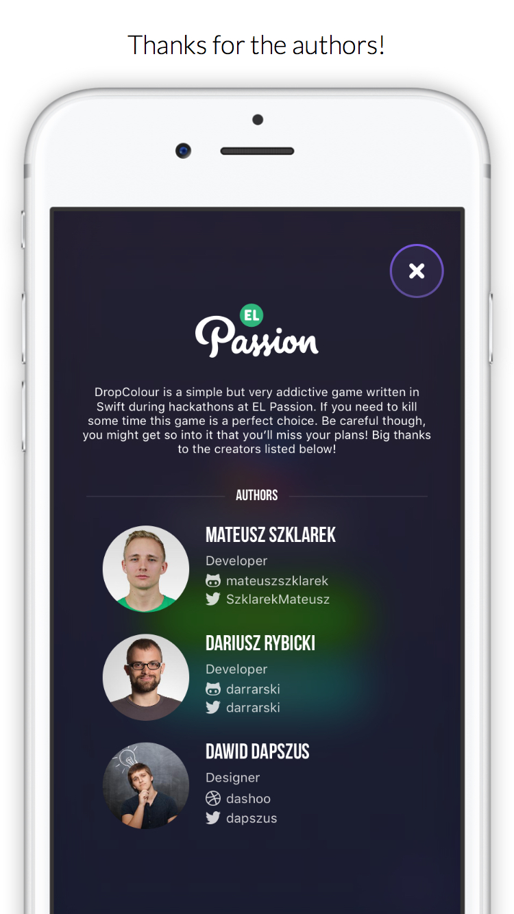

# DropColour - Open-Source Arcade Game for iOS

iOS project written in <a href="https://github.com/apple/swift">Swift 2.2</a> during several hackathons at <a href="http://www.elpassion.com">EL Passion</a>. DropColour is an arcade game in which you simply have to drag and drop one circle onto another of the same color. When you do that both circles will disappear from the screen with nice animation and sound. The game has no time limit.

    

## Data users info

<table>
  <tr align="center">
    <td>6530</td>
    <td>users :family:</td>
  </tr>
  <tr align="center">
    <td>18630</td>
    <td>game sessions :iphone:</td>
  </tr>
  <tr align="center">
    <td>3301</td>
    <td>users in rank :chart_with_upwards_trend:</td>
  </tr>
  <tr align="center">
    <td>100%</td>
    <td>users without crash :white_check_mark:</td>
  </tr>
  <tr align="center">
    <td>4'06"</a></td>
    <td>average playing time :alarm_clock:</td>
  </tr>
  <tr align="center">
    <td>1780 pts</a></td>
    <td>current highscore :rocket:</td>
  </tr>
</table>

## Supported languages

<table>
  <tr align="center">
    <td>Languages</a></td>
    <td>🇵🇱🇬🇧🇪🇸</td>
  </tr>
</table>

## Contributing to DropColour

We :heart: your feedback! If you notice any bug or want a new feature, just [open an Issue](https://github.com/elpassion/DropColour-iOS/issues/new)!

We also encourage you to make changes to the code - refactor it, add a feature, fix a typo. Even the smallest change counts!

Just follow these steps:

1. [Fork](https://help.github.com/articles/fork-a-repo/) the repository.
2. Create a [Feature Branch](https://help.github.com/articles/creating-and-deleting-branches-within-your-repository/) for your changes.
3. Make the changes to the code.
4. Create a [Pull Request](https://help.github.com/articles/creating-a-pull-request/).
5. After reviewing the code, we'll merge your changes!

If you like our work give us a :star: :)

## Authors and Contributors

- [Mateusz Szklarek](https://github.com/mateuszszklarek) ([@SzklarekMateusz](https://twitter.com/SzklarekMateusz)) - development
- [Dariusz Rybicki](https://github.com/darrarski) ([@darrarski](https://twitter.com/darrarski)) - development
- [Dawid Dapszus](https://dribbble.com/dashoo) ([@Dapszus](https://twitter.com/dapszus)) - design

## License

The MIT License (MIT) - check [LICENSE](LICENSE) file
