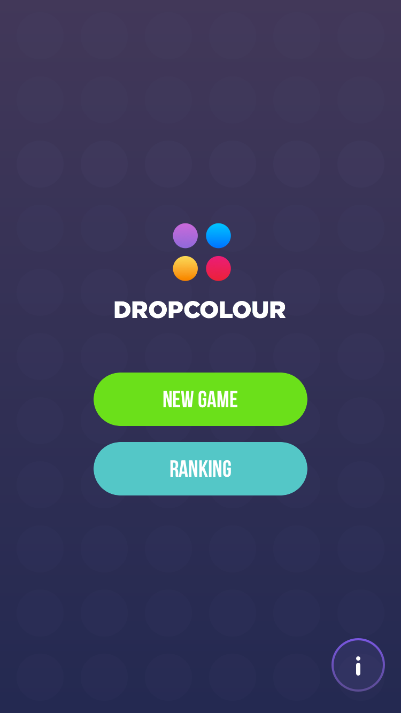

# DropColour - open-source game for iOS

Simple iOS project written in <a href="https://github.com/apple/swift">Swift 2.2</a> during several hackathons. DropColour is an arcade game in which you simply have to drag and drop one circle onto another of the same color. When you do that both circles will disappear from the screen with nice animation and a sound. The game has no time limit.

 

## Data users info

<table>
  <tr align="center">
    <td>5907</td>
    <td>user session :iphone:</td>
  </tr>
  <tr align="center">
    <td>3152</td>
    <td>users in rank :chart_with_upwards_trend:</td>
  </tr>
  <tr align="center">
    <td>100%</td>
    <td>users without crash :white_check_mark:</td>
  </tr>
  <tr align="center">
    <td>4'09"</a></td>
    <td>average playing time :alarm_clock:</td>
  </tr>
  <tr align="center">
    <td>1780 pts</a></td>
    <td>current highscore :rocket:</td>
  </tr>
</table>

## Authors

- Mateusz Szlarek - development <a href="https://twitter.com/SzklarekMateusz">@SzklarekMateusz</a>
- Dariusz Rybicki - development <a href="https://twitter.com/darrarski">@darrarski</a>
- Dawid Dapszus - design <a href="https://twitter.com/dapszus">@Dapszus</a>

## License

The MIT License (MIT) - check included [LICENSE](LICENSE) file
