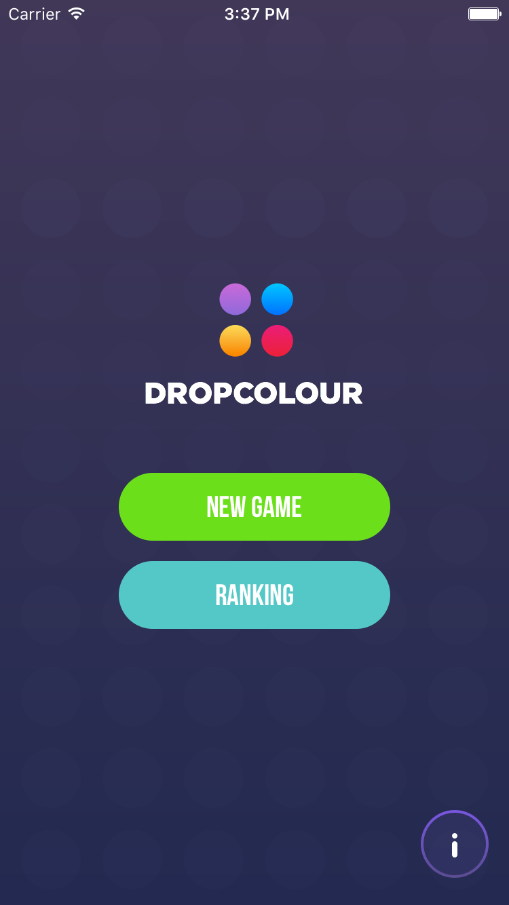
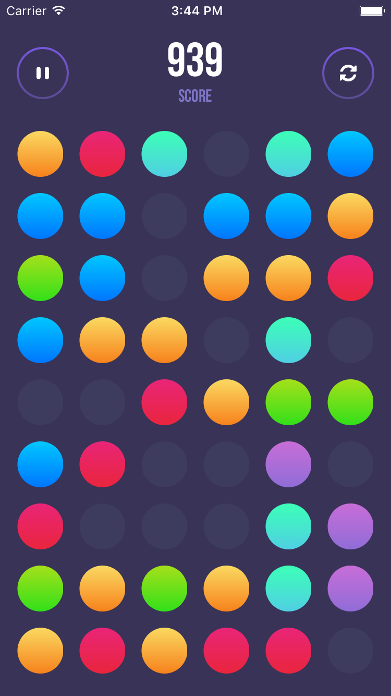

[](https://travis-ci.com/elpassion/el-color-game-ios)

# DropColour - game for iOS

Simple iOS game written in Swift 2.2 during hackathon.




--
babelish documentation
================
# Installation
```
sudo gem install babelish
```
# Update translations
```
babelish csv2strings
```
